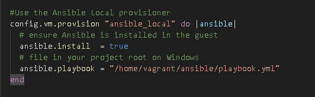
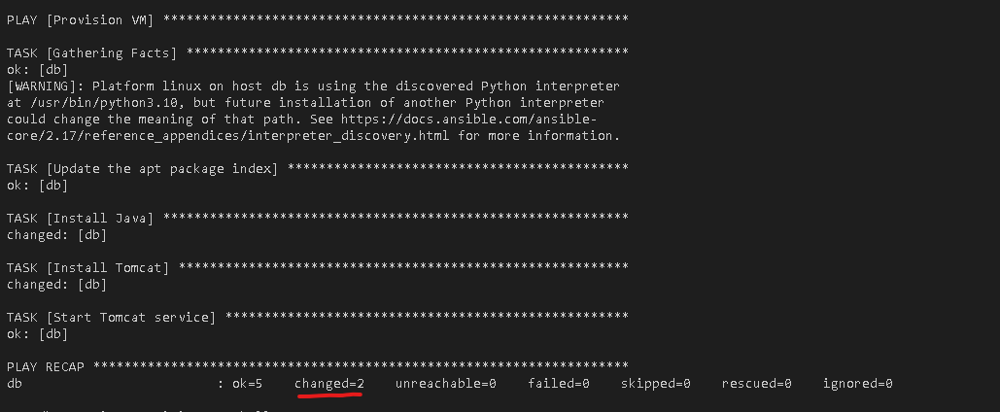
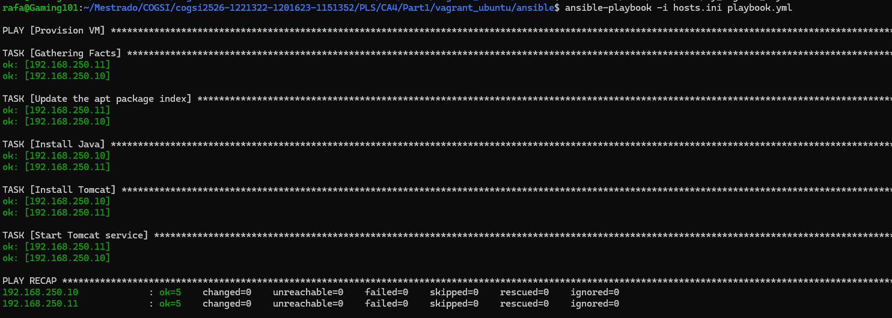
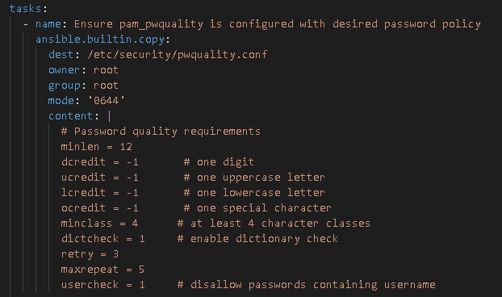
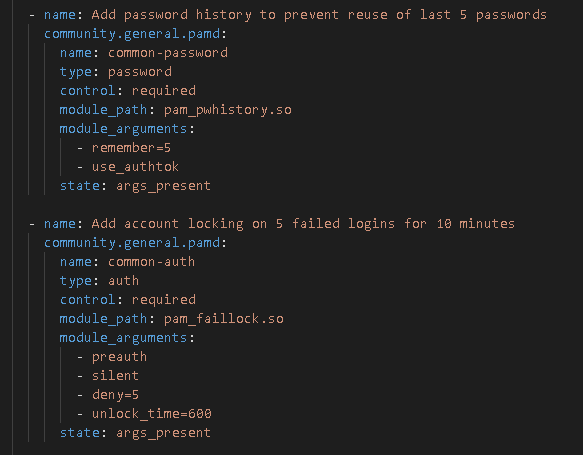
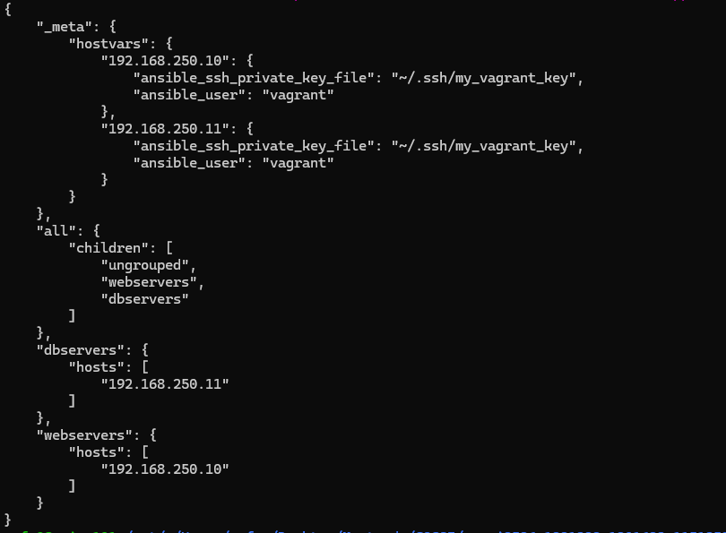
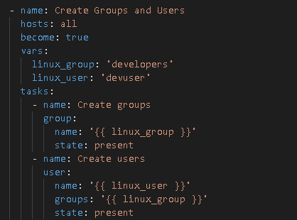
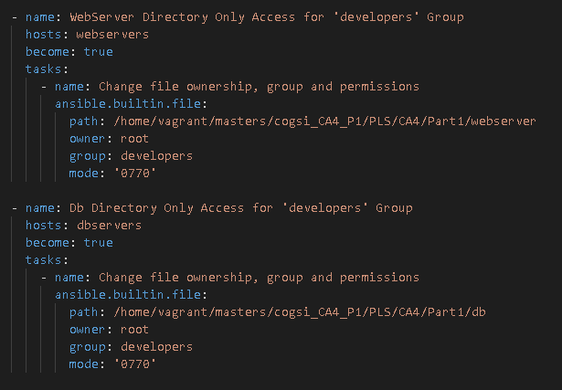
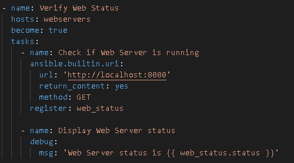
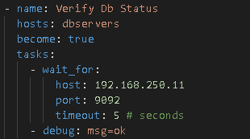

# cogsi2526-1221322-1201623-1151352

## Self-evaluation
Santiago- 33.3 %
Rafael - 33.3 %
Santiago -33.3 %
## Part 1

### 1 - Analysis / Requirements

1. The goal of this assignment is to evolve Part 2 of CA3 to use Ansible as a provisioner in both VMs

- Use Ansible to deploy and configure the Building REST services with Spring application into host1
- Use Ansible to deploy and configure H2 into host2

2. Ensure that your playbooks are idempotent

- Handle errors using failed_when, ignore_errors, retries/until where appropriate
- Run the playbook twice; the second run should show 0 (or minimal) changes. Paste both summaries

3. Use Ansible to configure PAM to enforce a complex password policy

- The password policy must enforce a minimum length of 12 characters, and require at least three of the four-character classes: uppercase letters, lowercase letters, digits, and symbols
- It must reject passwords containing common dictionary words and prevent reuse of the last five passwords ▪ Additionally, after five consecutive failed login attempts, the account should be locked for ten minutes
- Passwords that contain the username or parts of it are not permitted

4. Provide hosts.ini (static or the Vagrant auto-inventory path) and show ansible-inventory --list output

5. Use Ansible to create a group called developers and a user called devuser on the two VMs

- Place the Building REST services with Spring application on host1 and the database file in host2 in a directory only accessible to members of the developers group

6. Include health-check tasks in your playbook to verify that each service is running correctly

- On host1, use the uri module to send a request to http://localhost:<port> and confirm that the web application responds successfully
- On host2, use a task to check that the H2 database socket or port is open and accepting connection

### 3 - Implementation

1. The goal of this assignment is to evolve Part 2 of CA3 to use Ansible as a provisioner in both VMs

For this requirement, an ansible playbook was created in ansbile/playbook.yml that deploys and configures the Building REST services with Spring application into host1 and H2 into host2. The playbook uses the appropriate Ansible modules to ensure that the applications are installed and configured correctly.

Using Vagrant, the playbook can be automatically executed during the provisioning of the VMs. The Vagrantfile is configured to run the Ansible playbook after the VMs are created.
The following image represents the Vagrantfile configuration to use Ansible as a provisioner:

2. Ensure that your playbooks are idempotent

A failed when condition was added to the health-check tasks for the web, to ensure that the playbook is idempotent and handles errors appropriately.

      failed_when: web_status.status != 200

A ignore errors option was added to the health-check task for the web and db to handle potential transient issues when checking the web application status.

      ignore_errors: true

Delay were added to the health-check task for the database to handle potential transient issues when checking the database port.

        delay: 1

- Running two times:

The first time (in this case for the db) we can see two 2 changes and the rest oks

While the second time we can see that there are 0 changes and the rest oks

3. Use Ansible to configure PAM to enforce a complex password policy

The following task was added to the playbook to enforce the password policy using the community.general.pamd module:

The dictcheck option was set to 1 to reject passwords containing common dictionary words.

The following image represents the configuration to prevent reuse of the last five passwords and the account locking after five consecutive failed login attempts for ten minutes:

1. Provide hosts.ini (static or the Vagrant auto-inventory path) and show ansible-inventory --list output

A static file named hosts.ini was created in ansible/hosts.ini with the following content:

Command:

- ansible-inventory --list output -i hosts.ini

5. Use Ansible to create a group called developers and a user called devuser on the two VMs

After the group has been created, the following tasks will change the web and db directories permissions to be only accessible to members of the developers group:

1. Include health-check tasks in your playbook to verify that each service is running correctly

On the web host a health-check task was added to the playbook that uses the uri module to send a request to 'http://localhost:8080' and confirm that the web application responds successfully.

On the database host, a health-check task was added to the playbook that checks if the H2 database port (9092) is open and accepting connections.

## Alternative solution
Automation of Infrastructure and application deployment is essential for the successful implementation and reproducibility of an IT environment.
This is essential in the highly complex IT environment that most organizations employ.
Ansible is one of the most popular and well-known Infrastructure-as-Code (IaC) solution, and it's mainly used for configuring systems, provisioning infrastructure and deploying applications.
SaltStack is an IT automation engine for infrastructure management that combines a declarative YAML approach with event-drive automation.
Ansible employes the concept of Playbooks, also based on YAML, to describe automation jobs and utilizes agentless architecture for fast and secure operation.

This makes the platforms similar in terms of automation features, differing mainly in their design and focus.

### 1 - Analysis / Requirements
The architecture of Saltstack is based on "Salt Master" and "Salt Minion".
Being "Salt Master" the "Orchestrator" that controls "Salt Minion".
The goal of this assignment is to automate the configuration of two virtual machines, one for the "Building REST Services with Spring" application and the other for the database and automatically implement the requested features. 

### 2 - Design of the solution
In order to achieve the requirements of this assignment its needed to set up Salt Master in host1 virtual machine that will host the application and Salt Minion on host2, which is the virtual machine that will host the H2 database.

A configuration file must be set up in order to automate the installation of "Building REST Services with Spring" application on host1 and automate the deployment and configuration of H2 on host2 by interfacing with Salt Minion.
The following feature should also be implemented in the the configuration file:
- Configuration of Privilege Access Management by enforcing complex password policy.
- Creation of groups and users and restrict their access to the database only to these. 

### 3 - Implementation

The alternative solution implements the same requirements using SaltStack instead of Ansible. Here's the breakdown of the implementation:

#### Infrastructure Setup

The environment consists of two virtual machines running Ubuntu 22.04 (called host1 and host2). Both use a masterless SaltStack configuration for management and automation, which means that each VM applies its own states locally, without relying on a central server. The creation and orchestration of the machines is done through Vagrant, which facilitates the provisioning and automatic configuration of the virtual environment.

#### State Orchestration (top.sls)

First, two VMs (host1 and host2) are configured in the Vagrantfile. Next, the VM is provisioned with SaltStack in masterless mode, specifying the minion configuration file, the machine ID, and executing the highstate to apply all states, with colorful and detailed output, allowing parallel execution of states (Example of host1 configuration):

      host1.vm.synced_folder "salt/", "/srv/salt/"
      host1.vm.synced_folder "../../../../../cogsi2526-1221322-1201623-1151352", "/home/vagrant/vagrant_CogsiRepository"

      host1.vm.provider :virtualbox do |vb|
      vb.name = "host1"
      vb.memory = "6000"
      vb.cpus = 8
      end

      host1.vm.provision :salt do |salt|
      salt.masterless = true
      salt.minion_config = "salt/minion"
      salt.minion_id = "host1"
      salt.run_highstate = true
      salt.colorize = true
      salt.verbose = true
      salt.bootstrap_options = "-P"
      end

Next, top.sls defines which SaltStack states are applied to each machine. Host1 applies the webserver, security, users, and healthcheck states, while host2 applies database, security, users, and healthcheck:

      base:
            'host1':
            - webserver
            - security
            - users
            - healthcheck
            'host2':
            - database
            - security
            - users
            - healthcheck

This way, SaltStack knows which configurations to implement on each host.

#### Users and Access Control (users.sls)

The user.sls ensures that the developers group exists and that the devuser user is created and added to developers group, ensuring that the group is created before the user via the require dependency:

      users_group:
            group.present:
                  - name: developers

      devuser:
            user.present:
                  - name: devuser
                  - groups:
                        - developers
                  - require:
                        - group: developers

#### Security and PAM Configuration (security.sls)

This file installs packages needed to strengthen password security and configures PAM to enforce strong policies (as mentioned in the statement), defining complexity rules in /etc/security/pwquality.conf and controlling authentications in /etc/pam.d/common-password and /etc/pam.d/common-auth:

      install_pam_packages:
      pkg.installed:
      - pkgs:
            - libpam-pwquality
            - libpam-modules
            - cracklib-runtime
            - wamerican

      configure_pam_password_policy:
      file.managed:
      - name: /etc/security/pwquality.conf
      - contents: |
            minlen = 12
            minclass = 3
            dictcheck = 1
            usercheck = 1
            retry = 5
            enforce_for_root
            maxrepeat = 3
            dcredit = -1
            ucredit = -1
            lcredit = -1
            ocredit = -1

      configure_pam_common_password:
      file.managed:
      - name: /etc/pam.d/common-password
      - contents: |
            password        requisite                       pam_pwquality.so retry=3 dictcheck=1 enforce_for_root minlen=12 ucredit=-1 lcredit=-1 dcredit=-1 ocredit=-1 difok=4
            password        [success=2 default=ignore]      pam_unix.so use_authtok obscure sha512 remember=5
            password        [success=1 default=ignore]      pam_deny.so
            password        required                        pam_permit.so

      configure_pam_common_auth:
      file.managed:
      - name: /etc/pam.d/common-auth
      - contents: |
            auth    required                        pam_env.so
            auth    required                        pam_tally2.so deny=5 unlock_time=600 even_deny_root
            auth    [success=1 default=ignore]      pam_unix.so nullok
            auth    requisite                       pam_deny.so
            auth    required                        pam_permit.so

Complexity rules are defined in /etc/security/pwquality.conf, password verification and storage is managed in /etc/pam.d/common-password, and the authentication process, including blocking failed attempts, is controlled in /etc/pam.d/common-auth.

#### Spring Application Management (webserver.sls)

The webserver.sls file is used to configure the application automatically, and must contain the following methods:

      include:
        - users
      
      install_required_packages:
        pkg.installed:
          - pkgs:
            - openjdk-17-jdk
            - unzip
            - netcat
      
      app_directory:
        file.directory:
          - name: /opt/spring-app
          - user: devuser
          - group: developers
          - mode: 750
          - makedirs: True
          - require:
            - user: devuser
            - group: developers
      
      copy_gradle_app:
        file.recurse:
          - name: /opt/spring-app
          - source: salt://host1/spring-rest
          - user: devuser
          - group: developers
          - require:
            - file: app_directory
            - pkg: install_required_packages
      
      set_gradlew_permissions:
        file.managed:
          - name: /opt/spring-app/gradlew
          - mode: 755
          - replace: False
          - require:
            - file: copy_gradle_app
      
      build_spring_app:
        cmd.run:
          - name: cd /opt/spring-app && ./gradlew clean build
          - runas: devuser
          - require:
            - file: set_gradlew_permissions
      
      spring_app_service:
        file.managed:
          - name: /etc/systemd/system/spring-app.service
          - contents: |
              [Unit]
              Description=Spring REST Application
              After=network.target
      
              [Service]
              Type=simple
              User=devuser
              WorkingDirectory=/opt/spring-app
              ExecStart=/opt/spring-app/gradlew bootRun
              Restart=always
              RestartSec=10
      
              [Install]
              WantedBy=multi-user.target
          - mode: 644
          - require:
            - cmd: build_spring_app
      
        cmd.run:
          - name: systemctl daemon-reload
          - onchanges:
            - file: /etc/systemd/system/spring-app.service
      
        service.running:
          - name: spring-app
          - enable: True
          - require:
            - file: /etc/systemd/system/spring-app.service
            - cmd: build_spring_app
          - watch:
            - file: /etc/systemd/system/spring-app.service

The most important methods from those presented previously are:

install_required_packages: installs the necessary packages for the Spring application to run, including Java 17, unzip, and netcat.

build_spring_app: compiles and builds the Spring application using Gradle under the devuser account.

spring_app_service: creates a systemd service file to define how the Spring application runs, making it restart automatically on failure and available as a background service.

service.running: ensures that the Spring service is running and enabled to start automatically when the system boots.

#### Database Configuration (database.sls)

This is the file responsible for configuring the database, and it presents several methods:

      include:
      - users

      install_h2:
      pkg.installed:
      - pkgs:
            - openjdk-17-jdk
            - unzip
            - wget

      h2_directory:
      file.directory:
      - name: /opt/h2
      - user: devuser
      - group: developers
      - mode: 750
      - makedirs: True
      - require:
            - user: devuser
            - group: developers

      download_h2:
      cmd.run:
      - name: wget https://repo1.maven.org/maven2/com/h2database/h2/2.1.214/h2-2.1.214.jar -O /opt/h2/h2.jar
      - unless: test -f /opt/h2/h2.jar
      - require:
            - pkg: install_h2
            - file: h2_directory

      create_h2_data:
      cmd.run:
      - name: |
            mkdir -p /opt/h2/data
            chown -R devuser:developers /opt/h2
      - require:
            - cmd: download_h2

      h2_service:
      file.managed:
      - name: /etc/systemd/system/h2.service
      - contents: |
            [Unit]
            Description=H2 Database Server
            After=network.target

            [Service]
            Type=simple
            User=devuser
            ExecStart=/usr/bin/java -cp /opt/h2/h2.jar org.h2.tools.Server -tcp -web -baseDir /opt/h2/data -webAllowOthers -tcpAllowOthers
            Restart=always
            RestartSec=10

            [Install]
            WantedBy=multi-user.target
      - mode: 644
      - require:
            - cmd: create_h2_data

      systemd_reload_h2:
      cmd.run:
      - name: systemctl daemon-reload
      - onchanges:
            - file: h2_service

      h2_running:
      service.running:
      - name: h2
      - enable: True
      - require:
            - file: h2_service
            - cmd: systemd_reload_h2
      - watch:
            - file: h2_service

The most important/different methods from those presented previously are:

**install_h2:** installs the packages needed for H2 to run, including Java 17, unzip, and wget, which will be used to run and download the database.

**h2_service:** generates the systemd service file in /etc/systemd/system/h2.service, configuring H2 to run in server mode with access via TCP and Web, allowing external connections and automatic restart in case of failure.

**service.running:** ensures that the H2 service is active and enabled to start with the operating system, monitoring changes in the configuration file to restart the service when necessary.

#### Service Health Monitoring (healthcheck.sls)

Finally, the healthcheck.sls file tests whether the Spring application is responding on port 8080, ensuring that the spring_app_service service is active, and on host2, it checks whether the H2 database is listening on port 9092, ensuring that the h2_service service is running:

      
      check_spring_app:
      cmd.run:
      - name: curl -f http://localhost:8080 || exit 1
      - require:
            - service: spring_app_service
      

      
      check_h2_database:
      cmd.run:
      - name: nc -z localhost 9092 || exit 1
      - require:
            - service: h2_service
      

