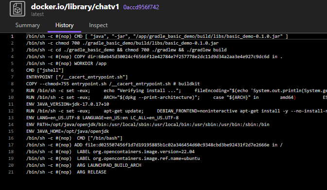
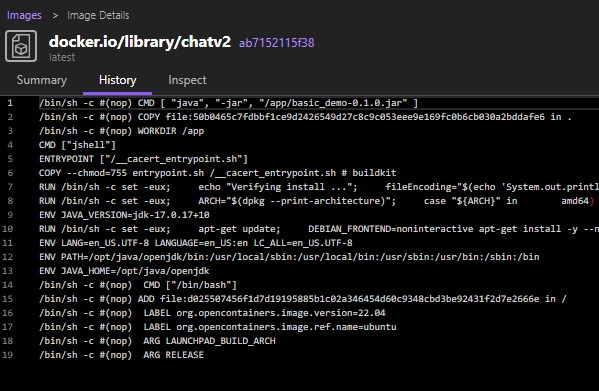
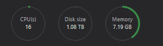

# cogsi2526-1221322-1201623-1151352

## Self-evaluation

# TODO

Santiago-
Rafael -
Joao -

## Part 1

### 1 - Analysis / Requirements

### 2 - Design of the solution

### 3 - Implementation

## Part 2

### 1 - Analysis / Requirements

### 2 - Design of the solution

### 3 - Implementation

## Alternative solution

### 1.1 - Requirements

1. Present an alternative technological solution for the container management tool i.e., not based on Docker

2. Analyze how the alternative solution compares to your base solution

- Present how the alternative tool compares to Docker regarding container management features
- Describe how the alternative tool could be used (i.e., only the design of the solution) to solve the same goals as presented for this assignment

3. To potentially achieve a complete solution of the assignment
   you should also implement the alternative design presented in
   the previous item

### 1.2 - Analysis

The choosen alternative for docker, as container management tool, is Podman.

Equally to Docker, Podman is an open-source containerization tool that allows users to create, manage, and run containers. However, Podman operates in a daemonless architecture, which means it does not require a background service to manage containers. This can lead to improved security and resource efficiency.

Both docker and Podman support the Open Container Initiative (OCI) standards for container images and runtimes, ensuring compatibility between the two tools. This means that containers created with Docker can be run using Podman and vice versa.

Docker and Podman can both create new images. They can also push and pull images to remote registries such as Docker Hub and GitHub Container Registry.

Diffrences between Docker and Podman:

- Daemonless Architecture: Podman does not need a daemon running as a background service, which can enachance security and reduce resource consumption.
- Rootless Containers: Podman allows users to run containers without root privileges, enhancing security by minimizing the risk of privilege escalation attacks.
- Compatibility with Docker CLI: Podman offers a command-line interface that is compatible with Docker commands, making it easier for users familiar with Docker to transition to Podman.
- Systemd Integration: Podman has built-in support for generating systemd unit files, facilitating the management of containers as system services.
- Different from Docker, Podman doesn't have a built-in orchestration tool like Docker Swarm. However, it can be used in conjunction with Kubernetes for container orchestration.

### 1.3 - Requirements of part 1 and 2

Podman can be used to achieve the same goals as Docker in this assignment by following a similar approach to containerization and orchestration.

The following steps resume the requirements of the assignment for part 1 and 2:

##### Part 1: Docker Fundamentals (Week 1)

- **Image Creation:** Create separate Docker images and containers for the "Chat" application and the "Building REST services with Spring" application.
- **Build Versions:** Implement two versions of the solution:
  - **Version 1:** Compile the application inside the Dockerfile.
  - **Version 2:** Compile on the host and copy the JAR into the image.
- **Image Analysis:** Use `docker history` to inspect layers and explain how build choices affect image size.
- **Optimization:** Implement multi-stage builds to verify efficiency and size reduction.
- **Monitoring:** Observe real-time resource usage (CPU, memory, I/O) while containers run.

##### Part 2: Orchestration with Docker Compose (Week 2)

- **Environment Setup:** Use Docker Compose to orchestrate the Gradle version of the Spring application.
- **Service Definition:** Define two services: `web` (Spring Boot app) and `db` (H2 database server).
- **Networking:** Verify connectivity and hostname resolution between services.
- **Resilience:** Configure a health check on the `db` service so the `web` service only starts when the database is ready.
- **Persistence:** Use a Docker volume for the `db` container to persist data outside the container's filesystem.
- **Configuration:** Use environment variables in Docker Compose to configure the services (e.g., DB credentials).

### 2 - Design of the solution

Part 1 and Part 2 of the assignment can be implemented using Podman by following similar steps as with Docker, with adjustments for Podman's specific commands and features.

#### Part 1

Similar to Docker, Podman can be used to create and manage container images for the "Chat" application and the "Building REST services with Spring" application. The two versions of the solution can be implemented by creating Podmanfiles (equivalent to Dockerfiles) for each version.

Podman also supports multi-stage builds, allowing for optimization of image size. The `podman history` command can be used to inspect image layers and analyze the impact of build choices on image size.

Monitoring resource usage can be done using Podman's built-in monitoring tools or by integrating with external monitoring solutions.

If the host wants, there is a possibility of grouping the containers using Podman pods, which provide a way to manage multiple containers as a single unit, similar to Docker Compose.


#### Part 2

Podman Compose, a tool similar to Docker Compose, can be used to orchestrate the Gradle version of the Spring application. The services can be defined in a `podman-compose.yml` file, specifying the `web` and `db` services.

Connectivity and hostname resolution between services can be verified using Podman's networking features. Health checks can be configured to ensure that the `web` service only starts when the `db` service is ready.

Using the podman volume feature, data persistence can be achieved for the `db` container. Environment variables can be set in the `podman-compose.yml` file to configure the services as needed.

In general, the design of the solution using Podman closely mirrors that of Docker, with adjustments made for the specific commands and features of Podman.

### 3 - Implementation

#### Image Creation: Create separate Docker images and containers for the "Chat" application and the "Building REST services with Spring" application.

- **Build Versions:** Implement two versions of the solution:
  - **Version 1:** Compile the application inside the Dockerfile.
  - **Version 2:** Compile on the host and copy the JAR into the image.

Part1 create the Podmanfiles for both versions of the applications:

- Spring Application Podmanfile (Version 1 - Compile inside Podmanfile)

      # Use a base image with Java (JDK)
      FROM eclipse-temurin:17-jdk-jammy

      # Set working directory
      WORKDIR /app

      # Copy the project files into the container
      COPY . .

      # === THIS INSTALLS DEPENDENCIES AND BUILDS THE APP ===
      # The 'gradlew' script downloads Gradle and all Java dependencies
      RUN cd ./Web && chmod 700 ./gradlew && ./gradlew build
      RUN chmod 700 ./Web/build/libs/Part2-0.0.1-SNAPSHOT.jar

      CMD [ "java", "-jar", "/app/Web/build/libs/Part2-0.0.1-SNAPSHOT.jar" ]

With this Podmanfile, the application is compiled in the image build process, and the final image contains the compiled JAR file.

- Spring Application Podmanfile (Version 2 - Compile on host and copy JAR)

In this case the application is compiled on the host machine, and only the resulting JAR file is copied into the image.

      # Use a base image with Java (JDK)
      FROM eclipse-temurin:17-jdk-jammy

      # Set working directory
      WORKDIR /app

      # Copy the pre-built JAR file into the container
      COPY ./Web/build/libs/Part2-0.0.1-SNAPSHOT.jar .

      CMD [ "java", "-jar", "/app/Part2-0.0.1-SNAPSHOT.jar" ]

- Chat Application Podmanfile (Version 1 - Compile inside Podmanfile)

Equaly to the Sprint application, here we copy the full project and compile it inside the podmanfile.

      # Use a base image with Java (JDK)
      FROM eclipse-temurin:17-jdk-jammy

      # Set working directory
      WORKDIR /app

      # Copy the project files into the container
      COPY . .

      # === THIS INSTALLS DEPENDENCIES AND BUILDS THE APP ===
      # The 'gradlew' script downloads Gradle and all Java dependencies
      RUN cd ./gradle_basic_demo && chmod 700 ./gradlew && ./gradlew build
      RUN chmod 700 ./gradle_basic_demo/build/libs/basic_demo-0.1.0.jar

      CMD [ "java", "-jar", "/app/gradle_basic_demo/build/libs/basic_demo-0.1.0.jar" ]

- Chat Application Podmanfile (Version 2 - Compile on host and copy JAR)

      # Use a base image with Java (JDK)
      FROM eclipse-temurin:17-jdk-jammy

      # Set working directory
      WORKDIR /app

      # Copy the pre-built JAR file into the container
      COPY ./gradle_basic_demo/build/libs/basic_demo-0.1.0.jar .

      CMD [ "java", "-jar", "/app/basic_demo-0.1.0.jar" ]

#### Image Analysis: Use `podman history` to inspect layers and explain how build choices affect image size.

In this first image all the layers created during the build process are visible, including those related to downloading dependencies and compiling the application. This results in a larger image size. (around 800mb)



In this second one, the image only contains the jar, showing a significant size reduction compared to the first approach.
And the number of layers is also reduced, since the build steps are not included in the image. (around 400mb)



#### Monitoring: Observe real-time resource usage (CPU, memory, I/O) while containers run.

Making use of the `podman stats` command, it is possible to monitor the resource usage of running containers in real-time. This command provides information about CPU, memory, and I/O usage for each container.

In this case for a convenient usage, the podman desktop was used, wich shows the cput usage and memory usage of each container in a graphical interface.



#### Optimization: Implement multi-stage builds to verify efficiency and size reduction.

Multi-stage builds can be implemented in Podmanfiles to optimize the image size by separating the build environment from the runtime environment. Here is the created example in the file multiStage.dockerfile

      FROM eclipse-temurin:17-jdk-jammy as builder

      WORKDIR /app

      # Copy the project files into the container
      COPY . .

      # === THIS INSTALLS DEPENDENCIES AND BUILDS THE APP ===
      # The 'gradlew' script downloads Gradle and all Java dependencies
      RUN cd ./SprintApp/Web && chmod 700 ./gradlew && ./gradlew build
      RUN chmod 700 ./SprintApp/Web/build/libs/Part2-0.0.1-SNAPSHOT.jar

      # Stage 2

      FROM gcr.io/distroless/java17

      WORKDIR /app

      COPY --from=builder /app/SprintApp/Web/build/libs/Part2-0.0.1-SNAPSHOT.jar /app/Part2.jar

      CMD [ "java", "-jar", "/app/Part2.jar" ]

      ```

In this case the first stage (builder) uses a full image to build the java file and all dependecies, then a second stage uses a smaller image, copies the built jar from the first stage, resulting in a smaller final image.

#### Environment Setup: Use Docker Compose to orchestrate the Gradle version of the Spring application.

Similar to Docker Compose, Podman Compose can be used to orchestrate multi-container applications. This step involves creating a `podman-compose.yml` file that defines the services, networks, and volumes needed for the application.

First podman compose has to be installed in your system.

After that, the `compose.yaml` file was created and run with the command `podman compose up -d`:

      services:
      web:
      build: ./springApp
      ports:
            - "8080:8080"
      restart: always

This files defines the web service, and runs the docker file, building the image and defining the ports to be used.

#### Service Definition: Define two services: `web` (Spring Boot app) and `db` (H2 database server).

      volumes:
      h2_data:

      services:
      web:
      build: ./springApp
      ports:
            - "8080:8080"
      restart: always

      environment:
            # This variable now resolves to: jdbc:h2:tcp://h2db:9092/mydb/appdb
            SPRING_DATASOURCE_URL: jdbc:h2:tcp://h2db:9092/mydb/appdb
            # This resolves to: my_secure_user (from .env)
            SPRING_DATASOURCE_USERNAME: ${H2_USER:-sa}
            # This resolves to: a_strong_password_1234 (from .env)
            SPRING_DATASOURCE_PASSWORD: ${H2_PASSWORD:-password}
            spring.jpa.hibernate.ddl-auto: update

      depends_on:
            h2db:
            condition: service_healthy

      h2db:
      build: ./db
      ports:
            - "9092:9092"
      restart: always
      volumes:
            - h2_data:/mydb
            # 2. Resilience: Health check configuration

      healthcheck:
            test: ["CMD", "nc", "-z", "localhost", "9092"] # Checks if the TCP port is listening
            interval: 10s
            timeout: 5s
            retries: 5
            start_period: 20s # Give the H2 server time to start up before checking

- **Networking:** Verify connectivity and hostname resolution between services.
- **Resilience:** Configure a health check on the `db` service so the `web` service only starts when the database is ready.
  Done using the healthcheck and depends_on in the compose file.

- **Persistence:** Use a Docker volume for the `db` container to persist data outside the container's filesystem.
  Done using the volumes key in the compose file.

- **Configuration:** Use environment variables in Docker Compose to configure the services (e.g., DB credentials).

Done using the environment key in the compose file.
