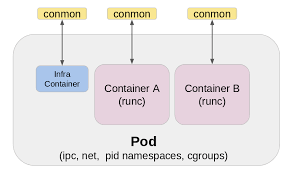

# cogsi2526-1221322-1201623-1151352

## Self-evaluation

# TODO

Santiago-
Rafael -
Joao -

## Part 1

### 1 - Analysis / Requirements

### 2 - Design of the solution

### 3 - Implementation

## Part 2

### 1 - Analysis / Requirements

### 2 - Design of the solution

### 3 - Implementation

## Alternative solution

### 1.1 - Requirements

1. Present an alternative technological solution for the container management tool i.e., not based on Docker

2. Analyze how the alternative solution compares to your base solution

- Present how the alternative tool compares to Docker regarding container management features
- Describe how the alternative tool could be used (i.e., only the design of the solution) to solve the same goals as presented for this assignment

3. To potentially achieve a complete solution of the assignment
   you should also implement the alternative design presented in
   the previous item

### 1.2 - Analysis

The choosen alternative for docker, as container management tool, is Podman.

Equally to Docker, Podman is an open-source containerization tool that allows users to create, manage, and run containers. However, Podman operates in a daemonless architecture, which means it does not require a background service to manage containers. This can lead to improved security and resource efficiency.

Both docker and Podman support the Open Container Initiative (OCI) standards for container images and runtimes, ensuring compatibility between the two tools. This means that containers created with Docker can be run using Podman and vice versa.

Docker and Podman can both create new images. They can also push and pull images to remote registries such as Docker Hub and GitHub Container Registry.

Diffrences between Docker and Podman:

- Daemonless Architecture: Podman does not need a daemon running as a background service, which can enachance security and reduce resource consumption.
- Rootless Containers: Podman allows users to run containers without root privileges, enhancing security by minimizing the risk of privilege escalation attacks.
- Compatibility with Docker CLI: Podman offers a command-line interface that is compatible with Docker commands, making it easier for users familiar with Docker to transition to Podman.
- Systemd Integration: Podman has built-in support for generating systemd unit files, facilitating the management of containers as system services.
- Different from Docker, Podman doesn't have a built-in orchestration tool like Docker Swarm. However, it can be used in conjunction with Kubernetes for container orchestration.

### 1.3 - Requirements of part 1 and 2

Podman can be used to achieve the same goals as Docker in this assignment by following a similar approach to containerization and orchestration.

The following steps resume the requirements of the assignment for part 1 and 2:

##### Part 1: Docker Fundamentals (Week 1)

- **Image Creation:** Create separate Docker images and containers for the "Chat" application and the "Building REST services with Spring" application.
- **Build Versions:** Implement two versions of the solution:
  - **Version 1:** Compile the application inside the Dockerfile.
  - **Version 2:** Compile on the host and copy the JAR into the image.
- **Image Analysis:** Use `docker history` to inspect layers and explain how build choices affect image size.
- **Optimization:** Implement multi-stage builds to verify efficiency and size reduction.
- **Monitoring:** Observe real-time resource usage (CPU, memory, I/O) while containers run.

##### Part 2: Orchestration with Docker Compose (Week 2)

- **Environment Setup:** Use Docker Compose to orchestrate the Gradle version of the Spring application.
- **Service Definition:** Define two services: `web` (Spring Boot app) and `db` (H2 database server).
- **Networking:** Verify connectivity and hostname resolution between services.
- **Resilience:** Configure a health check on the `db` service so the `web` service only starts when the database is ready.
- **Persistence:** Use a Docker volume for the `db` container to persist data outside the container's filesystem.
- **Configuration:** Use environment variables in Docker Compose to configure the services (e.g., DB credentials).

### 2 - Design of the solution

Part 1 and Part 2 of the assignment can be implemented using Podman by following similar steps as with Docker, with adjustments for Podman's specific commands and features.

#### Part 1

Similar to Docker, Podman can be used to create and manage container images for the "Chat" application and the "Building REST services with Spring" application. The two versions of the solution can be implemented by creating Podmanfiles (equivalent to Dockerfiles) for each version.

Podman also supports multi-stage builds, allowing for optimization of image size. The `podman history` command can be used to inspect image layers and analyze the impact of build choices on image size.

Monitoring resource usage can be done using Podman's built-in monitoring tools or by integrating with external monitoring solutions.

If the host wants, there is a possibility of grouping the containers using Podman pods, which provide a way to manage multiple containers as a single unit, similar to Docker Compose.

#### Part 2

Podman Compose, a tool similar to Docker Compose, can be used to orchestrate the Gradle version of the Spring application. The services can be defined in a `podman-compose.yml` file, specifying the `web` and `db` services.

Connectivity and hostname resolution between services can be verified using Podman's networking features. Health checks can be configured to ensure that the `web` service only starts when the `db` service is ready.

Using the podman volume feature, data persistence can be achieved for the `db` container. Environment variables can be set in the `podman-compose.yml` file to configure the services as needed.

In general, the design of the solution using Podman closely mirrors that of Docker, with adjustments made for the specific commands and features of Podman.

### 3 - Implementation
