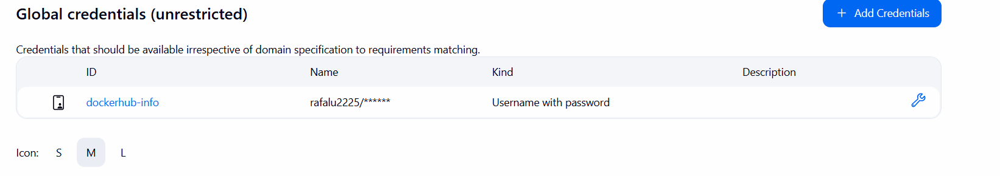

# cogsi2526-1221322-1201623-1151352

## Self-evaluation

# TODO

## Part 1

### 1 - Analysis / Requirements

### 2 - Design of the solution

### 3 - Implementation

## Part 2

### 1 - Analysis / Requirements

---

#### I. Pipeline Goal and Application Setup

- The goal is to create a CI/CD pipeline that **builds, publishes, and deploys** the Gradle-based Spring REST service.
- The application and the **H2 database** must be hosted and executed **within the same Docker container**.

#### II. Automated Infrastructure Setup

- **Production VM Creation:** Automate the creation of a production VM using **Vagrant** (i.e., by using a `Vagrantfile`).
- **Provisioning Tool:** Use **Ansible** for provisioning the production VM (i.e., by using a playbook).
- **Ansible Deployment Role:** The Ansible playbook must handle the following steps for deployment:
  - **Ensure Docker is installed** on the production VM.
  - **Login to Docker Hub** (using credentials).
  - **Pull the latest Docker image** from Docker Hub.
  - **Stop and remove the old container** if it exists.
  - **Run the new Docker container** successfully.

---

#### III. Jenkins Setup and Triggering

- **Jenkins Execution:** Run Jenkins on your **host machine**.
- **Pipeline Definition:** Define the pipeline logic in a **`Jenkinsfile`** stored in the repository.
- **Automated Trigger:** Configure a **GitHub webhook** to automatically trigger the Jenkins pipeline upon a new commit pushed to the **`main` or `development` branches**.

---

#### IV. Pipeline Structure and Logic

- **Parallel Testing:** Execute **unit and integration tests** in **parallel** to reduce overall runtime.
  - _Recommendation:_ Use **different Jenkins nodes** for parallel testing to demonstrate efficient resource utilization.
- **Conditional Deployment:** Ensure the **deployment to production only occurs** when a commit is pushed to the **`main` branch**.
  - Implement logic within the `Jenkinsfile` to verify the branch name before executing deployment actions.

---

#### V. Required Pipeline Stages

Define the following stages in the `Jenkinsfile`:

- **`Checkout`:** Pull the latest source code from the repository.
- **`Assemble`:** Compile the code and produce the artifact files (e.g., using `gradle build`).
- **`Test`:** Run unit and integration tests. **Publish the test results** (e.g., using the `junit` step) in Jenkins.
- **`Tag Docker Image`:** Build the application's Docker image and **tag it appropriately** (e.g., with the build number or branch name).
- **`Archive`:** **Archive the `Dockerfile`** and related metadata in Jenkins for traceability.
- **`Push Docker Image`:** Push the tagged Docker image to **Docker Hub** using appropriate **authentication credentials**.
- **`Deploy`:** Use the **Ansible playbook** to deploy the latest Docker image to the production VM.

---

#### VI. Post-Actions and Final Tagging

- **Notification:** Implement a **notification post-action** (e.g., Slack, Teams, or email) to send alerts for **success, failure, or unstable** build statuses.
- **Deployment Verification:** Add **automated health checks** after deployment to verify the application is functioning correctly in production.
- **Final Submission Tag:** Mark the final commit with the tag **`ca6-part2`**.

### 2 - Design of the solution

There are 2 parts for this solution:

- **Part 1**: Create a CI/CD pipeline using Jenkins to build, test, publish, and deploy a Gradle-based Spring REST service in a Docker container with an H2 database.
- **Part 2**: Automate the infrastructure setup using Vagrant and Ansible.

### 3 - Implementation

#### 3.1 - JeenkinsPipeline

This pipeline as said before is defined in a `Jenkinsfile` located in PLS/CA6/Part2/Jenkinsfile.
Before the implementation of the jenkinsfile, the master server has to be defined with all the necessary plugins and nodes.

In this case, a personal computer was used as the master server, running jenkins in a docker container with a public image jenkins/jenkins:lts.

#### 3.1.1 Public master server

Because the master server is running in a docker container in the port 8080 in localhost, for the webhook to work, the server must be publicly accessible. For this, ngrok was used to create a secure tunnel to localhost.

After downloading and installing ngrok, the following command was used to create the tunnel:

```bash
ngrok authtoken <your_auth_token>
ngrok http 8080
```


#### 3.1.2 Github Webhook

The first step is to create a webhook in the GitHub repository settings. The webhook should be configured to trigger a jenkins host on push events.

The payload URL should be set to the public URL provided by ngrok, followed by `/github-webhook/`. The content type should be set to `application/json`, and the events to trigger the webhook should be set to `Just the push event`.


After defining the webhook, the jenkins master server must be configured to accept incoming webhook requests. This typically involves setting up a Jenkins pipeline that listens for GitHub webhook events.

The following image shows the webhook definition in the GitHub repository, where the repository URL has been defined and the checkbox for push events has been selected:


The branches that will trigger the webhook are `main` and `CA6_P2`.


The following image shows the result of a successful webhook execution, where the last delivery was successfull:


#### 3.1.3 Jenkinsfile Stages

The Jenkinsfile is divided into the following stages:

0. Pipeline Definition

The options section was added to skip the default checkout of the code, as it is not necessary for this pipeline.The environment section defines a variable `DOCKER_IMAGE_TAG` that will be used to tag the docker image.

        options{
            skipDefaultCheckout()
        }

        environment {
            DOCKER_IMAGE_TAG = 'rafalu2225/cogsi_ca6:latest'
        }

1. Checkout

Because the jenkins by default checks out the code from the repository, this stage was modified to just print a message indicating that the code was checked out successfully.

        stage('Checkout') {
            steps {
              echo 'Source code from repository successfully checked out...'
            }
        }

2. Assemble

In this stage, the code is compiled and the artifacts are produced using gradle. The gradle wrapper is used to ensure that the correct version of gradle is used.

        stage('Assemble') {
            steps {
                echo 'Compiling code and producing artifacts...'
                dir('PLS/CA6/Part2/Web')  {
                  sh 'chmod +x ./gradlew'
                  sh './gradlew clean build'
                }
            }
        }

3. Test

Here, unit and integration tests are run. The test results are published in Jenkins using the junit step.

        stage('Test') {
          steps {
            echo "Running tests on Linux..."
            dir('PLS/CA6/Part2/Web')  {
                sh './gradlew test'
            }
            echo 'Publishing aggregated test results...'
            junit '**/*/test-results/test/*.xml'
          }
        }

4. Tag Docker Image

A docker image was created using the Dockerfile located in PLS/CA6/Part2/Dockerfile. This image contains the application and the H2 database.

    # Use a base image that has Java installed
    FROM eclipse-temurin:21-jdk-alpine

    # Install necessary tools (like bash)
    RUN apk update && apk add bash

    # Set the working directory
    WORKDIR /app

    COPY db/h2/bin/*.jar /app/db.jar
    COPY Web/build/libs/*.jar /app/backend.jar

    COPY dockerStartupFile.sh /app/startupScript.sh
    RUN chmod +x /app/startupScript.sh

    EXPOSE 8081

    CMD ["/app/startupScript.sh"]

The stage builds the docker image and tags it with the value defined in the environment variable `DOCKER_IMAGE_TAG`.

        stage('Tag Docker Image') {
            steps {
                script {
                    def appDir = 'PLS/CA6/Part2/'

                    sh "docker build -t ${env.DOCKER_IMAGE_TAG} ${appDir}"
                    echo "Successfully built and tagged image: ${env.DOCKER_IMAGE_TAG}"
                }
            }
        }

5. Archive

The archive stage archives the Dockerfile and related metadata in Jenkins for traceability.

        stage('Archive') {
            steps {
                echo "Archiving Dockerfile and build metadata..."
                archiveArtifacts artifacts: 'PLS/CA6/Part2/Dockerfile', fingerprint: true
            }
        }

6. Push Docker Image

This stage pushes the tagged docker image to Docker Hub using authentication credentials stored in Jenkins.

For security reasons, the docker hub credentials are stored inside the master server:



        stage('Push Docker Image') {
            steps {
                echo "Pushing Docker image ${env.DOCKER_IMAGE_TAG} to Docker Hub..."

                withCredentials(
                    [usernamePassword
                    (credentialsId: 'dockerhub-info',
                     passwordVariable: 'DOCKER_PASSWORD',
                      usernameVariable: 'DOCKER_USERNAME'
                      )
                    ])
                {
                    sh "echo \$DOCKER_PASSWORD | docker login -u \$DOCKER_USERNAME --password-stdin"
                    sh "docker push ${env.DOCKER_IMAGE_TAG}"
                }
            }
        }

7. Deploy to Production

Finaly, the deploy stage uses the Ansible playbook to deploy the latest docker image to the production VM.

        stage('Deploy to Production') {
            steps {
                echo "Deploying ${env.DOCKER_IMAGE_TAG} to production using Ansible..."
                dir('PLS/CA6/Part2/VagrantFile/') {
                    sh "vagrant up ProductionVm"
                }
            }
        }

# 3.2 - Vagrant and Ansible

The following vagrantfile creates a production VM using the `bento/ubuntu-22.04` box. The VM is configured with 6GB of RAM and 8 CPUs. The Ansible provisioner is used to run the playbook located in `ansible/playbook.yml`.

```ruby

Vagrant.configure("2") do |config|
  config.vm.box = "bento/ubuntu-22.04"

  config.vm.network "public_network"  # or default NAT

  # Explicit definition for the web VM
  config.vm.define "ProductionVm" do |pd|
    pd.vm.hostname = "ProductionVm"
    pd.vm.network "private_network", ip: "192.168.250.10"
    pd.vm.network "forwarded_port", guest: 8080, host: 8088
    pd.vm.synced_folder "./ansible", "/home/vagrant/ansible"

    pd.vm.provision "ansible_local" do |ansible|
      ansible.install  = true
      ansible.playbook = "/home/vagrant/ansible/playbook.yml"
    end


    pd.vm.provider :virtualbox do |vb|
      vb.name = "ProductionVm"
      vb.memory = "6000"
      vb.cpus = 8
    end
  end

end

```

The playbook performs the following tasks:

1. Update the apt package index and upgrade all packages.
2. Install Git.
3. Install Java.
4. Clone the repository.
5. Install Docker using the official convenience script.

```yaml
- name: Provision VM
  hosts: all
  become: true
  tasks:
    - name: Update the apt package index
      apt:
        update_cache: yes
        upgrade: yes

    - name: Install Git
      apt:
        name: git
        state: present

    - name: Install Java
      apt:
        name: openjdk-17-jdk
        state: present

    - name: Install PAM packages for password policies
      apt:
        name:
          - libpam-pwquality
          - libpam-modules
        state: present

    #- name: Docker Installation
    # apt:
    #   name:
    #      - docker-ce
    ##     - docker-ce-cli
    #     - containerd.io
    #     - docker-buildx-plugin
    #     - docker-compose-plugin
    #   state: present

    - name: Clone the repository
      git:
        repo: https://github.com/RafaeLuisPrf/cogsi2526-1221322-1201623-1151352.git
        dest: /home/vagrant/masters/cogsi_CA4_P1
        version: main # Adjust branch if needed
      become_user: vagrant # Run as vagrant user

    - name: Install Docker using official convenience script
      shell: |
        curl -fsSL https://get.docker.com -o get-docker.sh
        sh get-docker.sh
      args:
        creates: /usr/bin/docker
```

7. Docker user group management.
8. Login to Docker Hub.
9. Pull the latest docker image.
10. Run the application container.

```yaml
- name: Setup Docker Access
  hosts: all
  become: true # Need root permissions to modify users and groups

  tasks:
    - name: Ensure the remote user is in the 'docker' group
      ansible.builtin.user:
        name: '{{ ansible_user_id }}' # This variable holds the current remote connection user (e.g., 'vagrant')
        groups: docker
        append: true

- name: Docker Registry Login
  hosts: all
  become: true

  tasks:
    - name: Log into Docker Hub
      community.docker.docker_login:
        username: 'rafalu2225' #"{{ docker_registry_username }}"
        password: 'dckr_pat_FYswjpK31VabEG7dYPMHLzkGbxQ'
        state: present

    - name: Pull the docker image from Docker Hub
      community.docker.docker_image:
        name: rafalu2225/cogsi_ca6
        tag: latest
        state: present
        source: pull

    - name: Run the Application Container
      community.docker.docker_container:
        name: ca6-web-app # Defina um nome para o container
        image: rafalu2225/cogsi_ca6:latest-1
        state: started
        restart_policy: always # Garante que o container reinicie automaticamente
        ports:
          - '8080:8081' # Mapeia a porta 8080 do host para a porta 8080 do container
```

With this setup, the production VM will be automatically created and provisioned with Docker and the application will be deployed in a Docker container.

## Alternative solution

### 1.1 - Requirements

### 1.2 - Analysis

### 1.3 - Design of the solution

### 1.4 - Implementation
