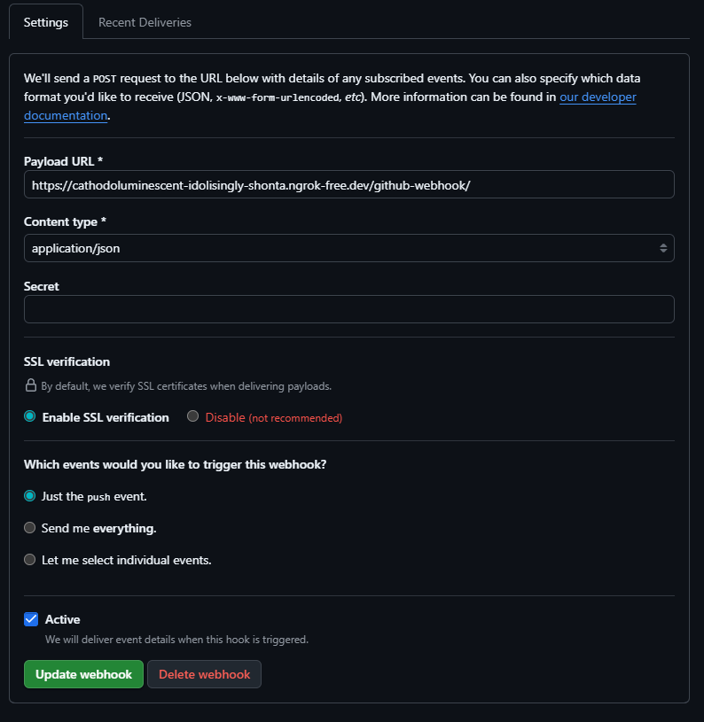

# cogsi2526-1221322-1201623-1151352

## Self-evaluation

# TODO

## Part 1

### 1 - Analysis / Requirements

### 2 - Design of the solution

### 3 - Implementation

## Part 2

### 1 - Analysis / Requirements

---

#### I. Pipeline Goal and Application Setup

- The goal is to create a CI/CD pipeline that **builds, publishes, and deploys** the Gradle-based Spring REST service.
- The application and the **H2 database** must be hosted and executed **within the same Docker container**.

#### II. Automated Infrastructure Setup

- **Production VM Creation:** Automate the creation of a production VM using **Vagrant** (i.e., by using a `Vagrantfile`).
- **Provisioning Tool:** Use **Ansible** for provisioning the production VM (i.e., by using a playbook).
- **Ansible Deployment Role:** The Ansible playbook must handle the following steps for deployment:
  - **Ensure Docker is installed** on the production VM.
  - **Login to Docker Hub** (using credentials).
  - **Pull the latest Docker image** from Docker Hub.
  - **Stop and remove the old container** if it exists.
  - **Run the new Docker container** successfully.

---

#### III. Jenkins Setup and Triggering

- **Jenkins Execution:** Run Jenkins on your **host machine**.
- **Pipeline Definition:** Define the pipeline logic in a **`Jenkinsfile`** stored in the repository.
- **Automated Trigger:** Configure a **GitHub webhook** to automatically trigger the Jenkins pipeline upon a new commit pushed to the **`main` or `development` branches**.

---

#### IV. Pipeline Structure and Logic

- **Parallel Testing:** Execute **unit and integration tests** in **parallel** to reduce overall runtime.
  - _Recommendation:_ Use **different Jenkins nodes** for parallel testing to demonstrate efficient resource utilization.
- **Conditional Deployment:** Ensure the **deployment to production only occurs** when a commit is pushed to the **`main` branch**.
  - Implement logic within the `Jenkinsfile` to verify the branch name before executing deployment actions.

---

#### V. Required Pipeline Stages

Define the following stages in the `Jenkinsfile`:

- **`Checkout`:** Pull the latest source code from the repository.
- **`Assemble`:** Compile the code and produce the artifact files (e.g., using `gradle build`).
- **`Test`:** Run unit and integration tests. **Publish the test results** (e.g., using the `junit` step) in Jenkins.
- **`Tag Docker Image`:** Build the application's Docker image and **tag it appropriately** (e.g., with the build number or branch name).
- **`Archive`:** **Archive the `Dockerfile`** and related metadata in Jenkins for traceability.
- **`Push Docker Image`:** Push the tagged Docker image to **Docker Hub** using appropriate **authentication credentials**.
- **`Deploy`:** Use the **Ansible playbook** to deploy the latest Docker image to the production VM.

---

#### VI. Post-Actions and Final Tagging

- **Notification:** Implement a **notification post-action** (e.g., Slack, Teams, or email) to send alerts for **success, failure, or unstable** build statuses.
- **Deployment Verification:** Add **automated health checks** after deployment to verify the application is functioning correctly in production.
- **Final Submission Tag:** Mark the final commit with the tag **`ca6-part2`**.

### 2 - Design of the solution

There are 2 parts for this solution:

- **Part 1**: Create a CI/CD pipeline using Jenkins to build, test, publish, and deploy a Gradle-based Spring REST service in a Docker container with an H2 database.
- **Part 2**: Automate the infrastructure setup using Vagrant and Ansible.

### 3 - Implementation

#### 3.1 - JeenkinsPipeline

This pipeline as said before is defined in a `Jenkinsfile` located in PLS/CA6/Part2/Jenkinsfile.
Before the implementation of the jenkinsfile, the master server has to be defined with all the necessary plugins and nodes.

In this case, a personal computer was used as the master server, running jenkins in a docker container with a public image jenkins/jenkins:lts.

#### 3.1.1 Public master server

Because the master server is running in a docker container in the port 8080 in localhost, for the webhook to work, the server must be publicly accessible. For this, ngrok was used to create a secure tunnel to localhost.

After downloading and installing ngrok, the following command was used to create the tunnel:

```bash
ngrok authtoken <your_auth_token>
ngrok http 8080
```


#### 3.1.2 Github Webhook

The first step is to create a webhook in the GitHub repository settings. The webhook should be configured to trigger a jenkins host on push events.

The payload URL should be set to the public URL provided by ngrok, followed by `/github-webhook/`. The content type should be set to `application/json`, and the events to trigger the webhook should be set to `Just the push event`.



After defining the webhook, the jenkins master server must be configured to accept incoming webhook requests. This typically involves setting up a Jenkins pipeline that listens for GitHub webhook events.

The following image shows the webhook definition in the GitHub repository, where the repository URL has been defined and the checkbox for push events has been selected:


The branches that will trigger the webhook are `main` and `CA6_P2`.


The following image shows the result of a successful webhook execution, where the last delivery was successful:


#### 3.1.2 Github Webhook

## Alternative solution

### 1.1 - Requirements

### 1.2 - Analysis

### 1.3 - Design of the solution

### 1.4 - Implementation
